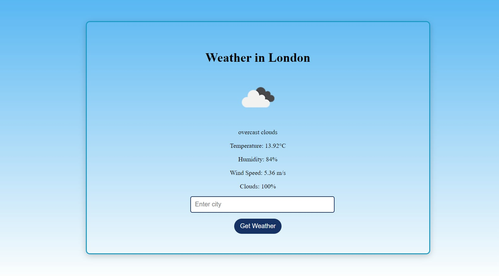

# weatherAPI

This is a simple web application built with **FastAPI** that allows users to fetch and display weather information for any specified city using the OpenWeatherMap API. The application provides a user-friendly interface where users can easily input the name of their desired city and retrieve real-time weather data, including temperature, humidity, wind speed, and overall weather conditions. 

## Features

- Retrieve current weather data for any city.
- Display temperature, weather description, humidity, wind speed, and cloudiness.
- User-friendly interface with HTML templates.
- Responsive design with CSS styling.

## Technologies Used

- **Python**: Programming language used for backend development.
- **FastAPI**: Modern web framework for building APIs in Python.
- **Jinja2**: Templating engine for rendering HTML.
- **HTML/CSS**: For structuring and styling the web interface.
- **OpenWeatherMap API**: Provides weather data.

## Screenshots

Here are some screenshots of the application:


*The home page showing weather data for London.*

### Obtaining an OpenWeatherMap API Key

To access weather data from the OpenWeatherMap API, you'll need to sign up for a free account and obtain an API key. Follow these steps:

1. **Visit the OpenWeatherMap website**:
   Go to [OpenWeatherMap](https://openweathermap.org/).

2. **Sign up for an account**:
   Click on the "Sign Up" button at the top right corner of the page. Fill in the required information to create your account.

3. **Verify your email**:
   After signing up, check your email for a verification message. Click the link in the email to verify your account.

4. **Log in to your account**:
   Once your account is verified, log in to the OpenWeatherMap website.

5. **Navigate to the API Keys section**:
   After logging in, go to your account dashboard. Look for a section labeled "API keys" in your profile settings.

6. **Generate an API key**:
   Click on the "Create" button to generate a new API key. You can name it anything you like (e.g., "weatherAPI"). 

7. **Copy your API key**:
   After generating your key, make sure to copy it. You will need to paste it into your project for the application to work.

8. **Add your API key to the project**:
   Open `main.py` in your project and replace the placeholder with your actual API key:
   ```python
   API_KEY = "" <- Your API key here

